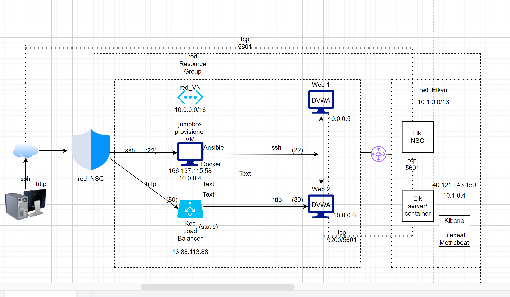

# Cloud Security Project

The files in this repository were used to configure the network depicted below.

These files have been tested and used to generate a live ELK deployment on Azure. They can be used to either recreate the entire deployment pictured above. Alternatively, select portions of the yaml files may be used to install only certain pieces of it, such as Filebeat.

[elk config](Ansible/install-elk.yml)

This document contains the following details:
- Description of the Topologu
- Access Policies
- ELK Configuration
  - Beats in Use
  - Machines Being Monitored
- How to Use the Ansible Build

### Description of the Topology

The main purpose of this network is to expose a load-balanced and monitored instance of DVWA, the D*mn Vulnerable Web Application.

Load balancing ensures that the application will be highly effective, in addition to restricting access to the network.
- Load balancers protect security by preventing unwanted or unauthorized traffic from reaching the application. 

Integrating an ELK server allows users to easily monitor the vulnerable VMs for changes to the configuration and system files.
- *Filebeat* watches for Log files or log events
- *Metricbeat* records metrics from on going services on the server

The configuration details of each machine may be found below.

| Name     | Function | IP Address | Operating System |
|----------|----------|------------|------------------|
| Jump Box | Gateway  | 10.0.0.4   | Linux            |
| web 1    | Webserver| 10.0.0.5   | Linux            |
| web 2    | Webserver| 10.0.0.6   | Linux            |
| elkvm    | Webserver| 10.1.0.4   | Linux            |

### Access Policies

The machines on the internal network are not exposed to the public Internet. 

Only the Jump-box-Provisioner machine can accept connections from the Internet. Access to this machine is only allowed from trusted addresses using inbound firewall rules.

Machines within the network can only be accessed by SSH.
- access was granted to select ip addresses based on principles of least privilige

A summary of the access policies in place can be found in the table below.

| Name     | Publicly Accessible | Allowed IP Addresses |
|----------|---------------------|----------------------|
| Jump Box | Yes                 | `[redacted]`         |
| web 1    | No                  | N/a                  |
| web 2    | No                  | N/a                  |
| elkvm    | Yes                 | `[redacted]`         |

 
### Elk Configuration

Ansible was used to automate configuration of the ELK machine. No configuration was performed manually, which is advantageous because...
- it is flexible and easily configurable
- it allows changes to be made within any of the VMs associated with it

The playbook implements the following tasks:
1) Install Docker.io 
2) Install python3-pip 
3) Install Docker Python Module 
4) Download and launch a Docker web container 
5) Download and launch a docker web container

### Target Machines & Beats
This ELK server is configured to monitor the following machines:
- 10.0.0.5 ( Web 1 )
- 10.0.0.6 ( Web 2 )

We have installed the following Beats on these machines:
- Filebeat
- Metricbeat

These Beats allow us to collect the following information from each machine:
  
*Filebeat*:
- monitors log files and log events
- Example: program logs, system events, application updates
  
*Metricbeat*:
- looks out for any resource usage on the host
- Example: ram/cpu usage, storage space, network traffic

### Using the Playbook
In order to use the playbook, you will need to have an Ansible control node already configured. Assuming you have such a control node provisioned: 

SSH into the control node and follow the steps below:
- Copy the ansible configuration file to run the playbooks.
- Update the ansible host file to include ip addresses of webserver and elk hosts
- Run the playbook, and navigate to the `http://<load balancer ip>/setup.php` to check that the installation worked as expected on the webservers and `http://<elk ip>:5601/app/kibana` to check that the installation worked as expected on the elk server.
